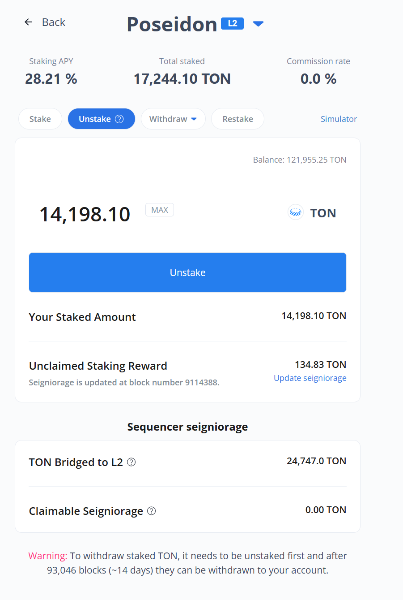

# Staking Community Version

> **A Community Version DApp for Tokamak Network's Staking Service**

Staking Community Version is a **DeFi staking application** that allows you to earn rewards by staking your TON and WTON tokens on the Tokamak Network.

## What This App Does

This is a **DeFi staking application** that allows you to:

- **Earn rewards** by staking your TON and WTON tokens
- **Choose validators** (operators) to stake with
- **Automatically reinvest** your earnings for compound growth
- **Connect your wallet** securely using MetaMask or other popular wallets
- **View real-time data** about your staking performance and rewards

The app works on **Ethereum mainnet** (for real transactions) and **Sepolia testnet** (for testing with fake tokens).

## Requirements

### What You Need
- **A computer** with Windows, Mac, or Linux
- **Internet connection** to download and run the app
- **A Web3 wallet** like MetaMask (recommended for beginners)

### Supported Networks
- **Ethereum Mainnet** - Production network for real transactions
- **Sepolia Testnet** - Test network for development and testing

## Quick Start

### Option 1: Run Locally (For Advanced Users)


**Step 1: Install Required Software**

**Windows Users:**
1. Download and install [Node.js](https://nodejs.org/) - **Choose the LTS version (Recommended)**
2. Download and install [Git for Windows](https://git-scm.com/download/win)

**Mac Users:**
1. Download and install [Node.js](https://nodejs.org/) - **Choose the LTS version (Recommended)**
2. Download and install [Git for Mac](https://git-scm.com/download/mac)

**Linux Users:**
```bash
sudo apt update
sudo apt install nodejs npm git
```

**Step 2: Verify Installation**
Open Command Prompt (Windows) or Terminal (Mac/Linux) and run:
```bash
node --version
npm --version
git --version
```
You should see version numbers for each command.

**Step 3: Download the App**
1. **Open Command Prompt (Windows) or Terminal (Mac/Linux)**
2. **Navigate to where you want to install the app** (e.g., Desktop):
   ```bash
   # Windows
   cd C:\Users\YourUsername\Desktop
   
   # Mac/Linux
   cd ~/Desktop
   ```
3. **Download the app:**
   ```bash
   git clone https://github.com/tokamak-network/staking-community-version.git
   cd staking-community-version
   ```

**Step 4: Install Dependencies**
```bash
npm install
```
This may take a few minutes. Wait until you see a success message.

**Step 5: Start the App**
```bash
npm run dev
```

The app will open in your browser at `http://localhost:3000`.

<!-- #### Option 2: Docker Installation (Easier, No Software Installation Required)

**What is Docker?**
Docker is a tool that packages everything needed to run an application into a "container" - like a pre-built box that contains everything the app needs.

**Step 1: Install Docker**

**Windows Users:**
1. Download [Docker Desktop for Windows](https://www.docker.com/products/docker-desktop/)
2. Install and restart your computer
3. Start Docker Desktop (it will appear in your system tray)

**Mac Users:**
1. Download [Docker Desktop for Mac](https://www.docker.com/products/docker-desktop/)
2. Install and restart your computer
3. Start Docker Desktop (it will appear in your menu bar)

**Linux Users:**
```bash
curl -fsSL https://get.docker.com -o get-docker.sh
sudo sh get-docker.sh
sudo usermod -aG docker $USER
# Log out and log back in
```

**Step 2: Verify Docker Installation**
Open Command Prompt (Windows) or Terminal (Mac/Linux) and run:
```bash
docker --version
docker-compose --version
```

**Step 3: Download and Run the App**
1. **Open Command Prompt (Windows) or Terminal (Mac/Linux)**
2. **Navigate to where you want to install the app:**
   ```bash
   # Windows
   cd C:\Users\YourUsername\Desktop
   
   # Mac/Linux
   cd ~/Desktop
   ```
3. **Download the app:**
   ```bash
   git clone https://github.com/tokamak-network/staking-community-version.git
   cd staking-community-version
   ```
4. **Run with Docker:**
   ```bash
   docker run -p 3000:3000 -v $(pwd):/app -w /app node:18 npm install
   docker run -p 3000:3000 -v $(pwd):/app -w /app node:18 npm run dev
   ```

**Note for Windows Users:** Replace `$(pwd)` with `%cd%` in the commands above.

The app will be available at `http://localhost:3000`. -->

<!-- ## 🔧 Troubleshooting

### Common Issues

#### 1. Wallet Connection Problems
- **Make sure MetaMask is installed** and unlocked
- **Check if you're on the right network** (Ethereum mainnet or Sepolia testnet)
- **Try refreshing the page** if the connection fails

#### 2. App Won't Start
- **Check if Node.js is installed** by running `node --version` in terminal
- **Make sure you're in the right folder** (staking-community-version)
- **Try deleting the `node_modules` folder** and running `npm install` again

#### 3. Can't See Your Tokens
- **Make sure you have TON or WTON tokens** in your wallet
- **Check if you're connected to the right network**
- **Verify your wallet is connected** to the app

#### 4. Docker Issues
- **Make sure Docker Desktop is running** (check system tray/menu bar)
- **Try restarting Docker Desktop** if commands fail
- **For Windows users**, make sure WSL2 is enabled -->

## 📱 How to Use the App

This guide will walk you through using the staking app step by step, with visual examples.

---

### 🔐 Step 1: Connect Your Wallet


1. **Click "Connect Wallet" button** on the main screen
2. **Choose MetaMask** (recommended for beginners)
3. **Approve the connection** in your wallet popup
4. **Switch to the right network** if prompted (Ethereum Mainnet or Sepolia Testnet)

---

### 🏠 Step 2: Main Dashboard


After connecting your wallet, you'll see the main staking dashboard showing:
- **Your wallet address** and connection status
- **Total staked amount** in the staking service
- **Current staking APY** 
- **List of available operators** to stake with

**Understanding the Dashboard:**
- **L2 tags** appear for operators that are L2 Sequencers
- **Total Staked** shows the amount staked to that specific operator
- **"Your Staked"** displays the amount you have staked to that operator
- **Click on a specific operator** to view detailed information

---

### 🎯 Step 3: Viewing Operator Details


On this screen, you can view the following information:
- **Total amount staked** to that operator
- **Commission rate** set by the operator
- **Your staked amount** to that operator
- **TON rewards** you can receive through Update Seigniorage
- **Last block number** when seigniorage was updated

**Claiming Rewards:**
- Click **Update Seigniorage** to claim unclaimed staking rewards
- **Confirm transaction** in your wallet

If the operator is an L2 Sequencer, you'll also see:
- **TON amount bridged** to that L2 network
- **TON amount** the L2 sequencer can claim

---

### 💰 Step 4: Input Staking Amount


**How Staking Works:**
- You can stake using **TON or WTON tokens** you own
- When **TON is selected**, the Balance shows your available TON amount
- When **WTON is selected**, the Balance shows your available WTON amount
- Click the **Max button** to input the maximum amount you can stake (e.g., 121,955.25 TON as shown in the image)

**Confirming Your Stake:**
- After entering the amount, if everything is correct, the button changes to **"Stake"**
- Click the **Stake button** to execute the staking transaction

---

### 🔄 Step 5: Managing Your Stakes

#### Unstake Your Stakes


**What is Unstake:**
- **Unstake** is the process to withdraw L1 staked amounts
- **Do NOT use Unstake** if you want to withdraw to L2 - use Withdraw-L2 instead
- **Maximum amount** you can input in Unstake is limited to your "Your Staked Amount"

**How to Unstake:**
1. Click the **Unstake button** on your staking position
2. **Enter the amount** you want to unstake
3. **Confirm the transaction** in your wallet 

#### 💸 Withdrawing Your Stakes

##### Option 1: L1 Withdrawal (Standard)


1. **Click the withdraw button** on your staking position
2. **Select L1 withdrawal** for standard Ethereum network
3. **Choose token** to withdraw - select TON to receive TON, select WTON to receive WTON
4. **Available withdrawal amount** is automatically calculated and filled in
5. **Confirm transaction** in your wallet

##### Option 2: L2 Withdrawal (If Available)


**What is L2 Withdrawal:**
L2 Withdrawal allows you to withdraw TON staked to an L2 network (e.g., Poseidon in the image above) where your operator acts as a sequencer. While L1 Withdrawals take about 2 weeks, L2 Withdrawals only require waiting for the L2 network to process the deposited amount.

**How to Withdraw to L2:**
1. **Select L2 withdrawal** if your operator supports it
2. **Choose withdrawal amount**
3. **Confirm the transaction**
4. **Wait for L2 processing** before funds are available


#### 🔄 Restake Your Stakes


**What is Restake:**
Restake is a feature that allows you to change your mind and stake again before the Withdrawal Delay period ends after unstaking. **Important:** The entire unstaking amount will be restaked, so use this feature carefully.

**How to Restake:**
1. **Check the pending amount** after unstaking
2. **Click Restake** to confirm
3. **Confirm the transaction** in your wallet

<!-- ## 🚀 Deployment

### For End Users

You don't need to worry about deployment! Just use the live app or follow the local setup instructions above.

### For Developers

If you're a developer and want to deploy this app:

#### Vercel (Easiest)
1. Install Vercel CLI: `npm i -g vercel`
2. Run: `vercel`
3. Follow the prompts

#### Docker
1. Build: `docker build -t staking-community-version .`
2. Run: `docker run -p 3000:3000 staking-community-version` -->

## Support 

- **GitHub Issues**: [Report bugs or request features](https://github.com/tokamak-network/staking-community-version/issues)


## 📄 License

This project is open source and distributed under the MIT License.


