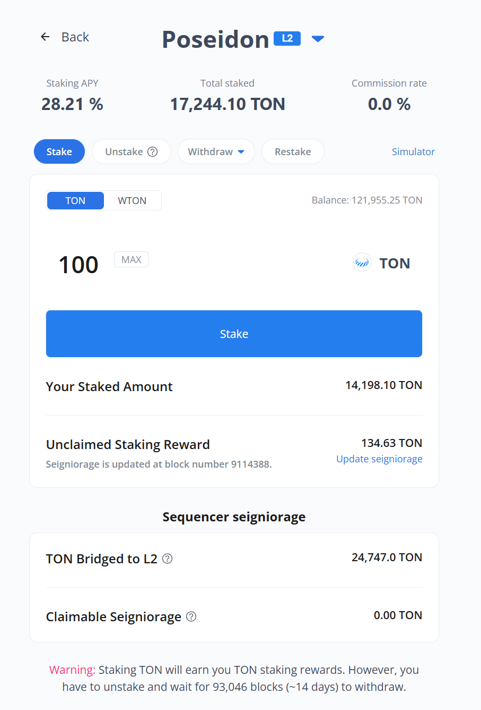
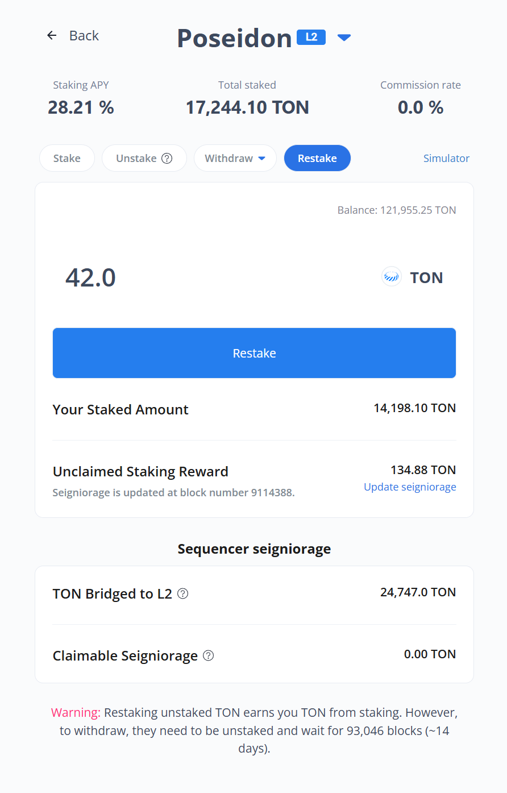

# Staking Community Version

> **A Community Version DApp for Tokamak Network's Staking Service**

Staking Community Version is a **DeFi staking application** that allows you to earn rewards by staking your TON and WTON tokens on the Tokamak Network.

## What This App Does

This is a **DeFi staking application** that allows you to:

- **Earn rewards** by staking your TON and WTON tokens
- **Choose validators** (operators) to stake with
- **Automatically reinvest** your earnings for compound growth
- **Connect your wallet** securely using MetaMask or other popular wallets
- **View real-time data** about your staking performance and rewards

The app works on **Ethereum mainnet** (for real transactions) and **Sepolia testnet** (for testing with fake tokens).

## Requirements

### What You Need
- **A computer** with Windows, Mac, or Linux
- **Internet connection** to download and run the app
- **A Web3 wallet** like MetaMask (recommended for beginners)

### Software Requirements
- **Node.js**: Version 18.0.0 or higher (LTS version recommended)
- **npm**: Version 9.0.0 or higher (comes with Node.js)
- **Git**: Version 2.0.0 or higher

### Supported Networks
- **Ethereum Mainnet** - Production network for real transactions
- **Sepolia Testnet** - Test network for development and testing

## Quick Start

### Option 1: Run Locally (For Advanced Users)

#### **Step 1: Install Required Software**

##### **Windows Users:**

**1. Install Node.js:**
- Go to [Node.js Official Website](https://nodejs.org/)
- **Download the LTS version** (Long Term Support - Recommended)
- Run the downloaded `.msi` file
- Follow the installation wizard (click "Next" through all steps)
- **Important:** Make sure to check "Add to PATH" during installation
- Restart your computer after installation

**2. Install Git:**
- Go to [Git for Windows](https://git-scm.com/download/win)
- Download the latest version
- Run the installer and use these recommended settings:
  - **Git from the command line and also from 3rd-party software** (default)
  - **Use bundled OpenSSH** (default)
  - **Use the OpenSSL library** (default)
  - **Checkout as-is, commit Unix-style line endings** (default)
  - **Use Windows' default console window** (default)
  - **Enable file system caching** (default)

**3. Open Command Prompt:**
- Press `Windows + R` key
- Type `cmd` and press Enter
- Or search for "Command Prompt" in the Start menu

##### **Mac Users:**

**1. Install Node.js:**
- Go to [Node.js Official Website](https://nodejs.org/)
- **Download the LTS version** (Long Term Support - Recommended)
- Run the downloaded `.pkg` file
- Follow the installation wizard
- **Alternative:** Install via Homebrew (if you have it):
  ```bash
  brew install node
  ```

**2. Install Git:**
- **Option A:** Download from [Git for Mac](https://git-scm.com/download/mac)
- **Option B:** Install via Homebrew:
  ```bash
  brew install git
  ```
- **Option C:** Git comes pre-installed on macOS 10.9+

**3. Open Terminal:**
- Press `Command + Space` to open Spotlight
- Type "Terminal" and press Enter
- Or go to Applications → Utilities → Terminal

##### **Linux Users:**

**1. Install Node.js and Git:**
```bash
<<<<<<< HEAD
# Clone the repository
git clone https://github.com/tokamak-network/staking-community-version
cd staking-community-version
=======
# Update package list
sudo apt update
>>>>>>> update-docs

# Install Node.js and npm
sudo apt install nodejs npm

# Install Git
sudo apt install git

# Verify versions
node --version
npm --version
git --version
```

**2. Alternative: Install Node.js via NodeSource (for latest versions):**
```bash
# Add NodeSource repository
curl -fsSL https://deb.nodesource.com/setup_lts.x | sudo -E bash -

# Install Node.js
sudo apt-get install -y nodejs

# Verify installation
node --version
npm --version
```

**3. Open Terminal:**
- Press `Ctrl + Alt + T` (most distributions)
- Or search for "Terminal" in your applications menu

#### **Step 2: Verify Installation**

**Open your terminal/command prompt and run these commands:**

```bash
# Check Node.js version (should show v18.x.x or higher)
node --version

# Check npm version (should show 9.x.x or higher)
npm --version

# Check Git version (should show 2.x.x or higher)
git --version
```

**Expected Output Example:**
```bash
v18.17.0
9.6.7
git version 2.39.2
```

**If you see "command not found" errors:**
- **Windows:** Restart your computer after installation
- **Mac:** Restart Terminal or restart your computer
- **Linux:** Log out and log back in, or restart your computer

#### **Step 3: Download the App**

**1. Open your terminal/command prompt:**
- **Windows:** Command Prompt (cmd) or PowerShell
- **Mac:** Terminal
- **Linux:** Terminal

**2. Navigate to where you want to install the app:**
```bash
# Windows - Navigate to Desktop
cd C:\Users\YourUsername\Desktop

# Mac/Linux - Navigate to Desktop
cd ~/Desktop

# Alternative locations:
# Windows - Documents folder
cd C:\Users\YourUsername\Documents

# Mac/Linux - Documents folder
cd ~/Documents

# Mac/Linux - Home directory
cd ~
```

**3. Download the app:**
```bash
# Clone the repository
git clone https://github.com/tokamak-network/staking-community-version.git

# Navigate into the project folder
cd staking-community-version
```

**Expected Output:**
```bash
Cloning into 'staking-community-version'...
remote: Enumerating objects: xxx, done.
remote: Counting objects: 100% (xxx/xxx), done.
remote: Compressing objects: 100% (xxx/xxx), done.
Receiving objects: 100% (xxx/xxx), done.
Resolving deltas: 100% (xxx/xxx), done.
```

#### **Step 4: Install Dependencies**

**Install all required packages:**
```bash
npm install
```

**What happens during installation:**
- Downloads all required packages (React, Next.js, Web3 libraries, etc.)
- Creates `node_modules` folder with dependencies
- Installs packages based on `package.json` file
- May take 2-5 minutes depending on your internet speed

**Expected Output:**
```bash
added 1234 packages, and audited 1234 packages in 1s
found 0 vulnerabilities
```

**If you see errors:**
- **Network issues:** Try again or check your internet connection
- **Permission errors:** On Mac/Linux, try `sudo npm install`
- **Version conflicts:** Make sure you have Node.js 18+ installed

#### **Step 5: Start the App**

**Start the development server:**
```bash
npm run dev
```

**What happens:**
- Starts the Next.js development server
- Compiles your application
- Opens the app in your default browser
- Enables hot reloading (changes appear instantly)

**Expected Output:**
```bash
> staking-community-version@0.0.0 dev
> next dev

  ▲ Next.js 14.2.4
  - Local:        http://localhost:3000
  - Network:      http://192.168.1.100:3000
 ✓ Ready in 2.3s
```

**Access the app:**
- **Local access:** http://localhost:3000
- **Network access:** http://[your-ip-address]:3000 (for testing on other devices)

**If the browser doesn't open automatically:**
- Manually open your browser
- Navigate to `http://localhost:3000`
- The app should load and show the staking interface

<!-- #### Option 2: Docker Installation (Easier, No Software Installation Required)

**What is Docker?**
Docker is a tool that packages everything needed to run an application into a "container" - like a pre-built box that contains everything the app needs.

**Step 1: Install Docker**

**Windows Users:**
1. Download [Docker Desktop for Windows](https://www.docker.com/products/docker-desktop/)
2. Install and restart your computer
3. Start Docker Desktop (it will appear in your system tray)

**Mac Users:**
1. Download [Docker Desktop for Mac](https://www.docker.com/products/docker-desktop/)
2. Install and restart your computer
3. Start Docker Desktop (it will appear in your menu bar)

**Linux Users:**
```bash
curl -fsSL https://get.docker.com -o get-docker.sh
sudo sh get-docker.sh
sudo usermod -aG docker $USER
# Log out and log back in
```

**Step 2: Verify Docker Installation**
Open Command Prompt (Windows) or Terminal (Mac/Linux) and run:
```bash
docker --version
docker-compose --version
```

**Step 3: Download and Run the App**
1. **Open Command Prompt (Windows) or Terminal (Mac/Linux)**
2. **Navigate to where you want to install the app:**
   ```bash
   # Windows
   cd C:\Users\YourUsername\Desktop
   
   # Mac/Linux
   cd ~/Desktop
   ```
3. **Download the app:**
   ```bash
   git clone https://github.com/tokamak-network/staking-community-version.git
   cd staking-community-version
   ```
4. **Run with Docker:**
   ```bash
   docker run -p 3000:3000 -v $(pwd):/app -w /app node:18 npm install
   docker run -p 3000:3000 -v $(pwd):/app -w /app node:18 npm run dev
   ```

**Note for Windows Users:** Replace `$(pwd)` with `%cd%` in the commands above.

The app will be available at `http://localhost:3000`. -->

## 🔧 Troubleshooting

### Common Installation Issues

#### 1. **"Command not found" errors:**
```bash
# Windows
node --version  # Shows "node is not recognized"
npm --version   # Shows "npm is not recognized"

# Solution:
# 1. Restart your computer after installation
# 2. Check if Node.js is in your PATH
# 3. Reinstall Node.js and check "Add to PATH"
```

#### 2. **Git clone fails:**
```bash
# Error: "git is not recognized"
# Solution: Restart computer after Git installation

# Error: "Permission denied"
# Solution: Run Command Prompt as Administrator (Windows)
# Or use: sudo git clone [url] (Mac/Linux)
```

#### 3. **npm install fails:**
```bash
# Error: "npm ERR! code ENOENT"
# Solution: Make sure you're in the right folder
pwd  # Check current directory
ls   # List files (should see package.json)

# Error: "npm ERR! code EPERM"
# Solution: On Mac/Linux, try:
sudo npm install

# Error: "npm ERR! code ENOTFOUND"
# Solution: Check internet connection, try again
```

#### 4. **App won't start:**
```bash
# Error: "Port 3000 is already in use"
# Solution: Kill the process or use different port
npm run dev -- -p 3001

# Error: "Module not found"
# Solution: Reinstall dependencies
rm -rf node_modules package-lock.json
npm install
```

### Common App Issues

#### 1. **Wallet Connection Problems:**
- **Make sure MetaMask is installed** and unlocked
- **Check if you're on the right network** (Ethereum mainnet or Sepolia testnet)
- **Try refreshing the page** if the connection fails

#### 2. **Can't See Your Tokens:**
- **Make sure you have TON or WTON tokens** in your wallet
- **Check if you're connected to the right network**
- **Verify your wallet is connected** to the app

#### 3. **Performance Issues:**
- **Close other browser tabs** to free up memory
- **Restart the development server** if it becomes slow
- **Check your internet connection** for blockchain data

## How to Use the App

This guide will walk you through using the staking app step by step, with visual examples.

---

### Step 1: Connect Your Wallet


1. **Click "Connect Wallet" button** on the main screen
2. **Choose MetaMask** (recommended for beginners)
3. **Approve the connection** in your wallet popup
4. **Switch to the right network** if prompted (Ethereum Mainnet or Sepolia Testnet)

---

### Step 2: Main Dashboard


After connecting your wallet, you'll see the main staking dashboard showing:
- **Your wallet address** and connection status
- **Total staked amount** in the staking service
- **Current staking APY** 
- **List of available operators** to stake with

**Understanding the Dashboard:**
- **L2 tags** appear for operators that are L2 Sequencers
- **Total Staked** shows the amount staked to that specific operator
- **"Your Staked"** displays the amount you have staked to that operator
- **Click on a specific operator** to view detailed information

---

### Step 3: Viewing Operator Details


On this screen, you can view the following information:
- **Total amount staked** to that operator
- **Commission rate** set by the operator
- **Your staked amount** to that operator
- **TON rewards** you can receive through Update Seigniorage
- **Last block number** when seigniorage was updated

**Claiming Rewards:**
- Click **Update Seigniorage** to claim unclaimed staking rewards
- **Confirm transaction** in your wallet

If the operator is an L2 Sequencer, you'll also see:
- **TON amount bridged** to that L2 network
- **TON amount** the L2 sequencer can claim

---

### Step 4: Input Staking Amount


**How Staking Works:**
- You can stake using **TON or WTON tokens** you own
- When **TON is selected**, the Balance shows your available TON amount
- When **WTON is selected**, the Balance shows your available WTON amount
- Click the **Max button** to input the maximum amount you can stake (e.g., 121,955.25 TON as shown in the image)

**Confirming Your Stake:**
- After entering the amount, if everything is correct, the button changes to **"Stake"**
- Click the **Stake button** to execute the staking transaction

---

### Step 5: Managing Your Stakes

#### Unstake Your Stakes


**What is Unstake:**
- **Unstake** is the process to withdraw L1 staked amounts
- **Do NOT use Unstake** if you want to withdraw to L2 - use Withdraw-L2 instead
- **Maximum amount** you can input in Unstake is limited to your "Your Staked Amount"

**How to Unstake:**
1. Click the **Unstake button** on your staking position
2. **Enter the amount** you want to unstake
3. **Confirm the transaction** in your wallet 

#### Withdrawing Your Stakes

##### Option 1: L1 Withdrawal (Standard)


1. **Click the withdraw button** on your staking position
2. **Select L1 withdrawal** for standard Ethereum network
3. **Choose token** to withdraw - select TON to receive TON, select WTON to receive WTON
4. **Available withdrawal amount** is automatically calculated and filled in
5. **Confirm transaction** in your wallet

##### Option 2: L2 Withdrawal (If Available)


**What is L2 Withdrawal:**
L2 Withdrawal allows you to withdraw TON staked to an L2 network (e.g., Poseidon in the image above) where your operator acts as a sequencer. While L1 Withdrawals take about 2 weeks, L2 Withdrawals only require waiting for the L2 network to process the deposited amount.

**How to Withdraw to L2:**
1. **Select L2 withdrawal** if your operator supports it
2. **Choose withdrawal amount**
3. **Confirm the transaction**
4. **Wait for L2 processing** before funds are available


#### Restake Your Stakes


**What is Restake:**
Restake is a feature that allows you to change your mind and stake again before the Withdrawal Delay period ends after unstaking. **Important:** The entire unstaking amount will be restaked, so use this feature carefully.

**How to Restake:**
1. **Check the pending amount** after unstaking
2. **Click Restake** to confirm
3. **Confirm the transaction** in your wallet

<!-- ## 🚀 Deployment

### For End Users

You don't need to worry about deployment! Just use the live app or follow the local setup instructions above.

### For Developers

If you're a developer and want to deploy this app:

#### Vercel (Easiest)
1. Install Vercel CLI: `npm i -g vercel`
2. Run: `vercel`
3. Follow the prompts

#### Docker
1. Build: `docker build -t staking-community-version .`
2. Run: `docker run -p 3000:3000 staking-community-version` -->

## Support 

- **GitHub Issues**: [Report bugs or request features](https://github.com/tokamak-network/staking-community-version/issues)


## License

This project is open source and distributed under the MIT License.


